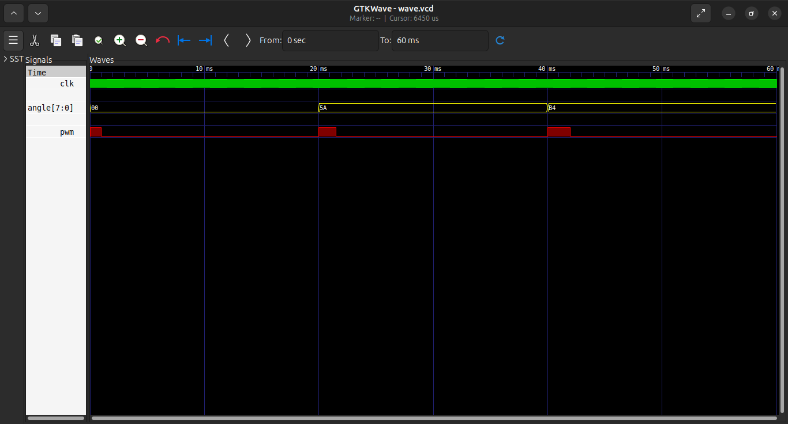
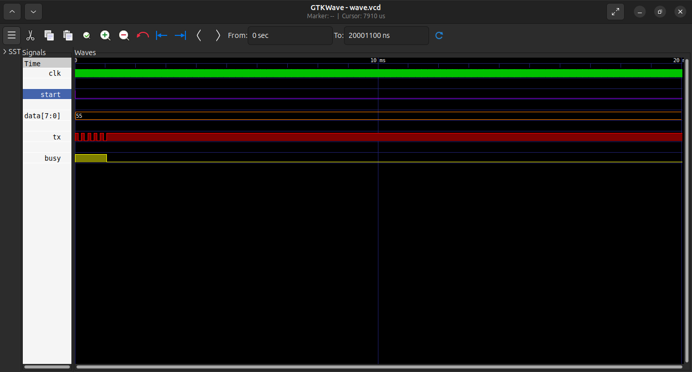
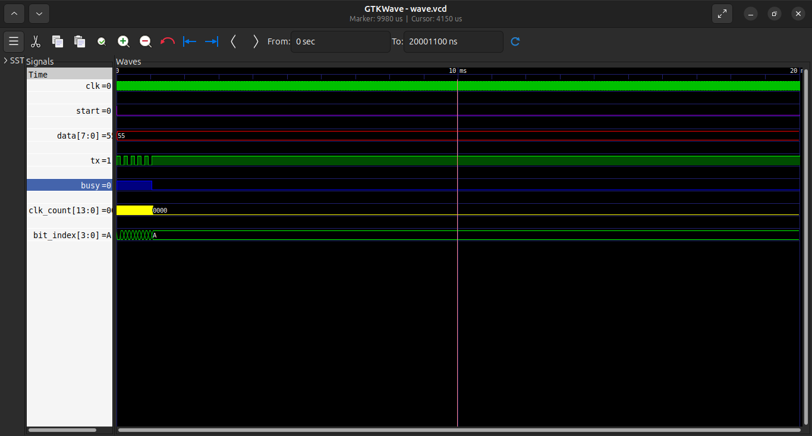

# 🚀 FPGA Based Radar & Target Tracking System

## 📌 Overview

This project presents the design and simulation of an FPGA-based radar and target tracking system. The system uses ultrasonic sensing to detect objects, a servo motor for scanning, and Python-based visualization to display real-time radar data.

## ⚙️ Key Features

* PWM-based servo motor control
* Ultrasonic sensor interfacing
* Real-time angle scanning (0° to 180°)
* Distance measurement and processing
* UART communication for data transfer
* Python-based radar visualization

## 🛠️ Technologies Used

* Verilog HDL (FPGA Design)
* Python (Matplotlib, PySerial)
* FPGA Board: Nexys A7 (Artix-7)

## 🧪 Simulation

The system is verified using Verilog testbench and waveform analysis.

## 📊 Working Principle

1. Servo motor rotates from 0° to 180°
2. Ultrasonic sensor measures distance at each angle
3. FPGA processes angle and distance
4. Data is sent via UART to PC
5. Python displays radar-like visualization

## 📂 Project Structure

* `verilog/` → FPGA design modules
* `simulation/` → Testbench & waveform
* `python/` → Visualization code
* `docs/` → Diagrams & output images
* `constraints/` → FPGA pin mapping

## 📷 Results

## 🚀 Future Scope

* Multiple object tracking
* GUI-based radar system
* AI-based object classification
* Hardware optimization

## 👨‍💻 Author

**Pawan Kushwah**
B.Tech Electronics & Communication Engineering
HNB Garhwal University

## ⭐ Note

This project demonstrates the integration of digital design, embedded systems, and real-time visualization using FPGA.
